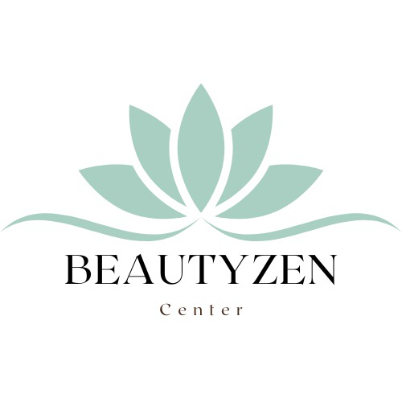
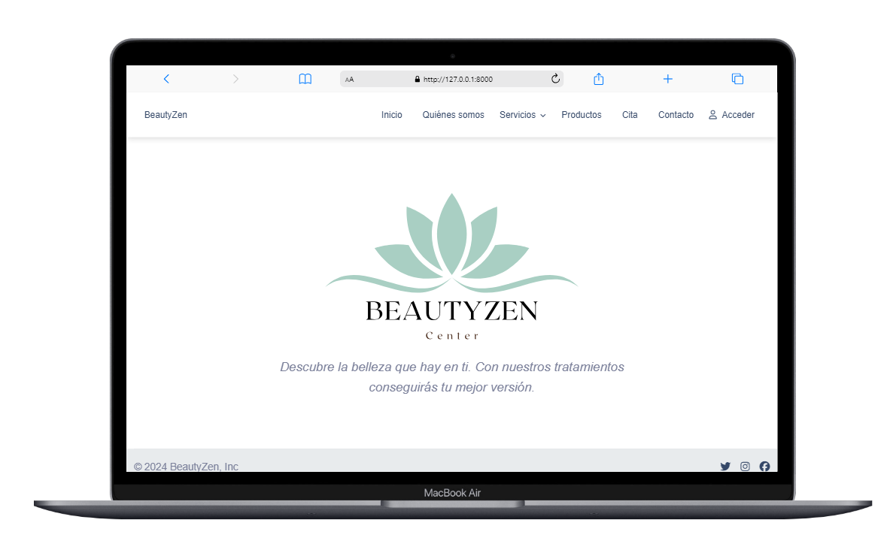
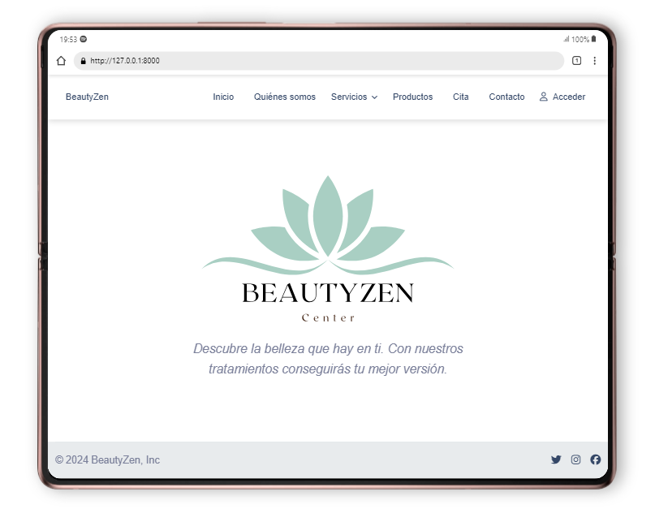
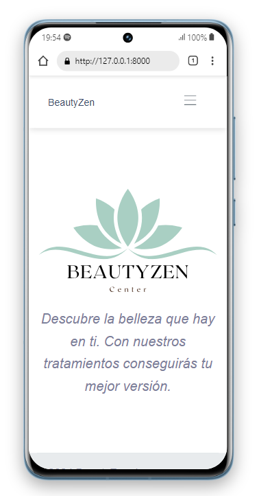

# BeautyZen App

**BeautyZen** es una aplicación web que ha sido desarrollada para ofrecer operaciones CRUD, un sistema de autenticación y registro de clientes, administradores y empleados de un centro de estética. Es un proyecto educativo de prueba, ciertos apartados no están terminados ni configurados. 

## Tecnologías🛠️
* [PHP 8.2.4](https://www.php.net/releases/8_2_4.php)
* [Laravel 10](https://laravel.com/docs/10.x)
* [Laravel Breeze](https://laravel.com/docs/10.x/starter-kits#laravel-breeze)
* API
* CRUD
* MySQl
* PHPUnit
* Visual Studio Code

## Instalación ⚙️

1. Clona este repositorio en tu máquina local usando `git clone <URL del repositorio>`.

2. Instala las dependencias de PHP usando Composer con `composer install`.

3. Copia el archivo de configuración `.env.example` y configúralo con tu entorno y el archivo `.env`.

4. Genera una clave de aplicación con `php artisan key:generate`.

5. Configura tu base de datos en el archivo `.env`.

6. Ejecuta las migraciones con `php artisan migrate`.

7. Ejecuta las semillas para los datos con `php artisan db:seed`.

8. Inicia el servidor de desarrollo con `php artisan serve`.

9. Accede a la aplicación en tu navegador web en [http://localhost:8000](http://localhost:8000).

## Vistas
### Laptop

### Tablet

### Móvil

## Login
Los siguientes perfiles te permitirán acceder a la aplicación según el rol que elijas. Los empleados pueden ser médico, estético,  auxiliar o recepcionista.

**Administrador**:
correo: nuria@hotmail.com
contraseña: contrasenia1234 

**Empleado**: 
correo: ana@gmail.com
contraseña: contrasenia1234 

**Cliente**:
correo: maria@gmail.com
contraseña: contrasenia1234 

## Agradecimientos🍀
¡Muchas gracias por haber llegado hasta aquí!

